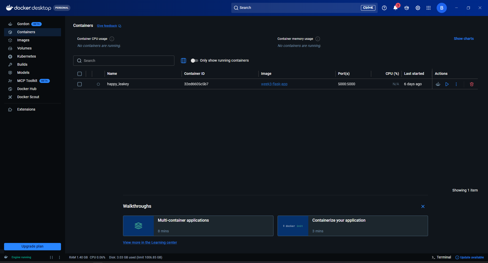
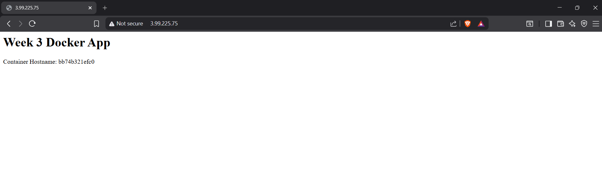
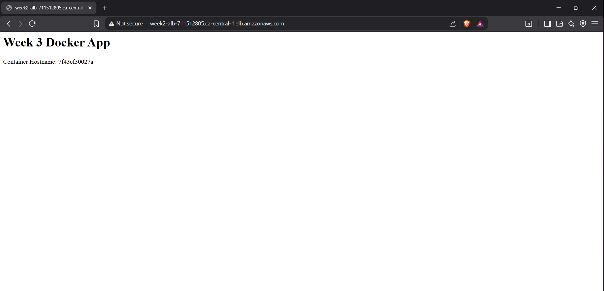
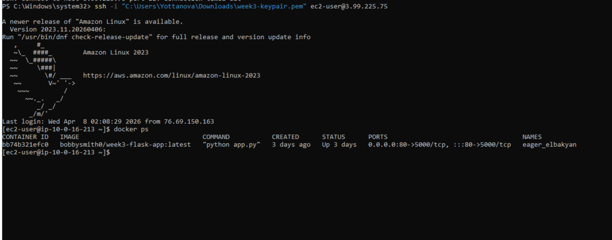

# AWS  - Dockerized-app-aws-ec2-alb

## Overview

This project demonstrates containerizing a Python Flask application using Docker and deploying it on AWS EC2 behind an Application Load Balancer.

The goal was to move from manual, instance-based configuration to a portable and consistent application runtime.

## Objectives

- Containerize an application using Docker  
- Ensure consistent runtime across environments  
- Deploy containerized application on EC2  
- Integrate with existing AWS architecture (ALB + Auto Scaling)


## Architecture

Request flow:

User → Application Load Balancer → EC2 (Docker container) → Flask App  


## Evolution 

- Previous Version: Application deployed directly on EC2 instances  
- Now: Application packaged into Docker container and deployed consistently  

This removes environment inconsistencies and simplifies deployment.

## Tech Stack
- Python (Flask)
- Docker / Docker Hub
- AWS EC2
- Application Load Balancer
- Auto Scaling Group


## How to Run Locally
```bash
dokcer pull bobbysmith0/week3-flask-app:lastest
dokcer run -p 5000:5000 bobbysmith0/week3-flask-app:lastest
```
Visit http://localhost:5000

## Docker Hub
https://hub.docker.com/r/bobbysmith0/week3-flask-app

## Deployment (EC2)
```bash
docker pull bobbysmith0/week3-flask-app:latest
docker run -d -p 80:5000 bobbysmith0/week3-flask-app:latest
```
## Validation / Testing

To confirm correct deployment:
Verified container runs locally via Docker
Verified application accessible via EC2 public IP
Verified application accessible through ALB
Confirmed consistent behavior across environments

## Design Decisions and Tradeoffs
**Why Docker**

Docker allows the application and dependencies to be packaged into a single unit, ensuring consistent behavior across environments.

**Tradeoff**

Adds build and image management overhead.

Why EC2 (instead of ECS/EKS)

Used EC2 for simplicity and transparency at this stage.

**Tradeoff**

Less scalable and less automated compared to container orchestration platforms.

**Why retain ALB**

Reused Week 2 architecture to maintain high availability and load distribution.


## Screenshots

### 1. Docker Hub showing `app.py` is pushed.


### 2. App running directly on EC2


### 3. App running through ALB


### 4. Results of Docker PS


## What I Learned
Containers standardise application runtime across environments
Docker simplifies deployment and portability
Infrastructure shifts from “configuring servers” to “running defined workloads”
Combining Docker with existing AWS architecture improves consistency without sacrificing availability

## Future Improvements
Integrate CI/CD pipeline for automated deployment
Move to container orchestration (ECS or Kubernetes)
Add health checks and container monitoring

